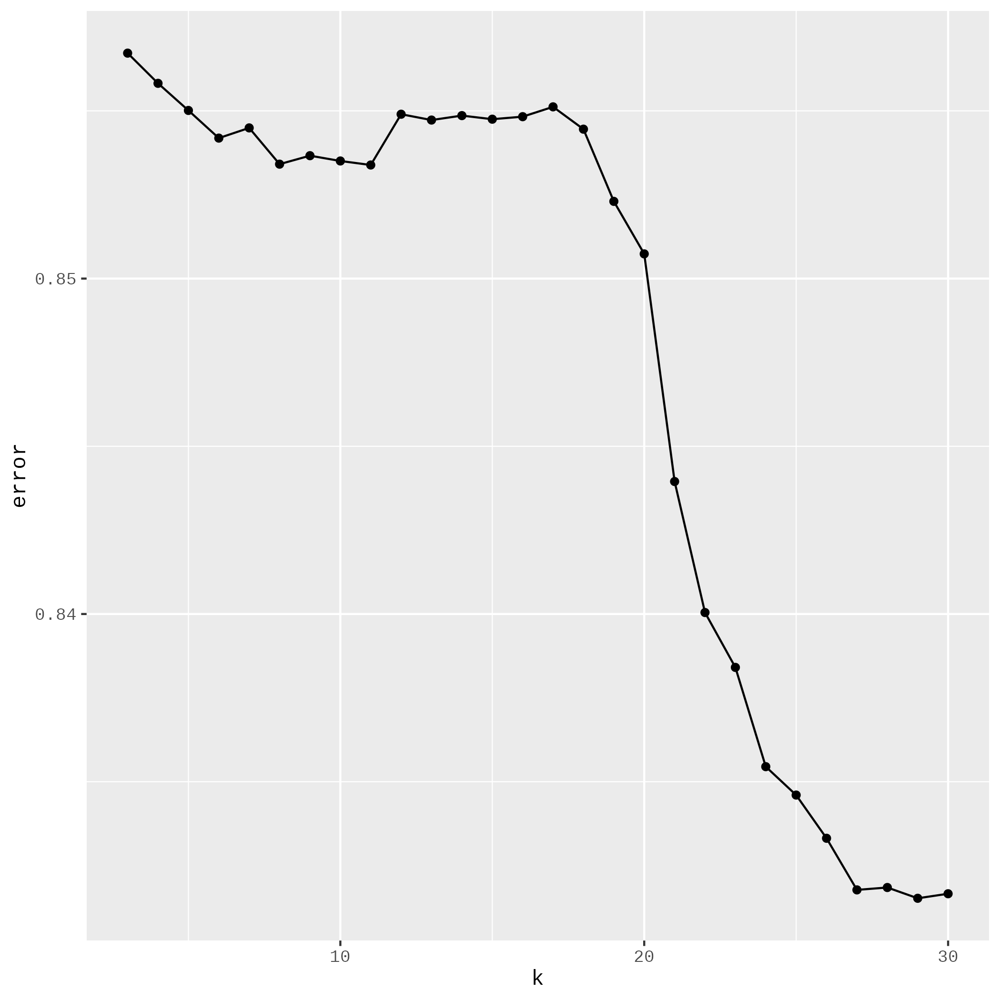
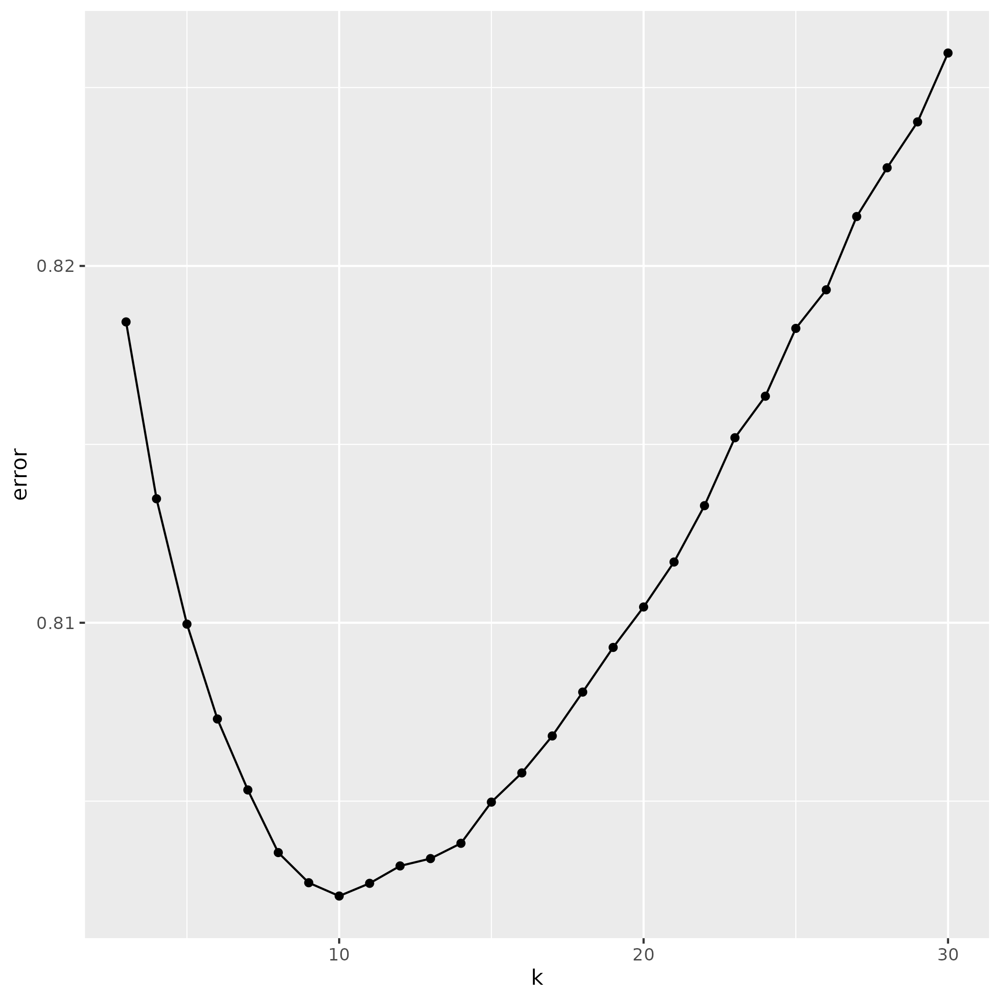
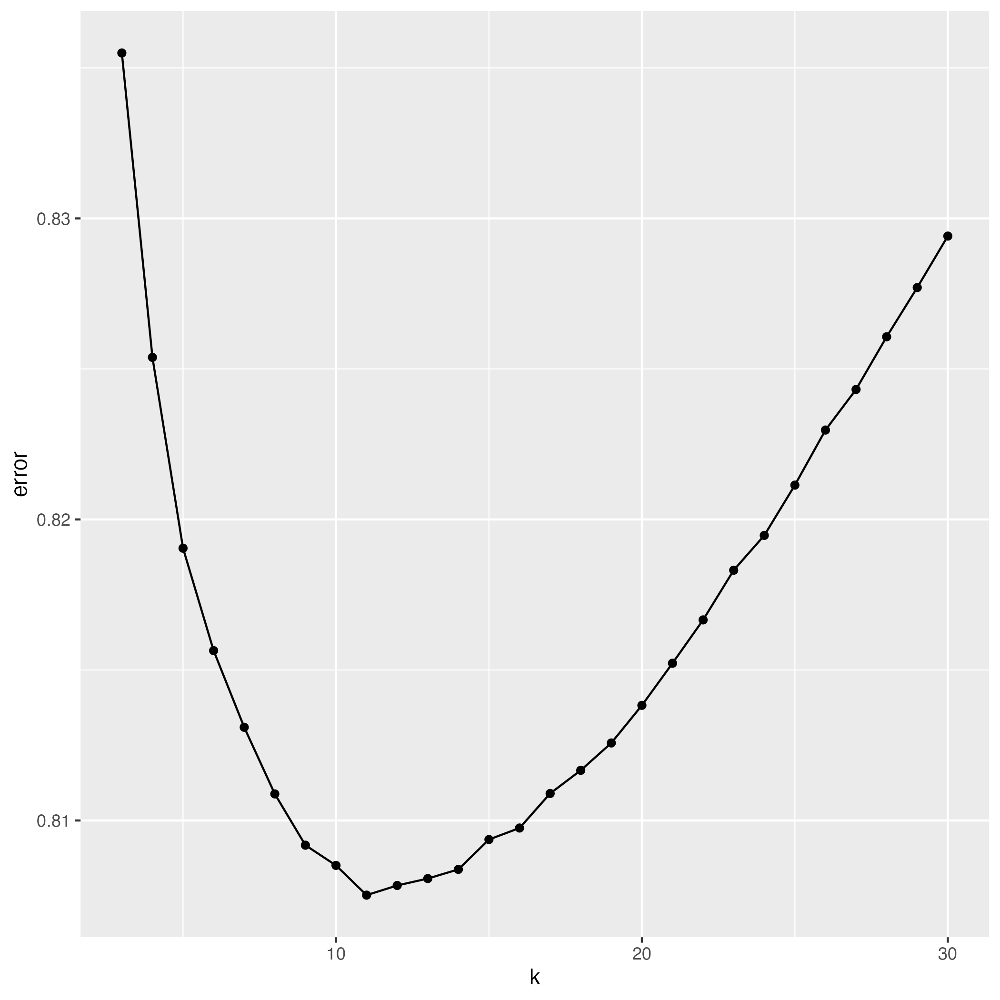

# Introduction

For years, many companies have tried to build a better recommendation algorithm from the MovieLens data set. As part of the Havard Data Science program, we have also decided to introduce ourselves to the recommendation algorithm world by working on MovieLens to propose a model that will outperform the existing ones.

There are many different MovieLens data sets, each different in size: 32 MB, 1MB, 1B, 100K, 1M, 10M, 20M, 25M. In this project, we will work with the MovieLens 10M data set. It was released in 1/2009 and consists of 10 million ratings and 100.000 tag applications applied to 100.000 movies by 72.000 users. The MovieLens 10M data set provided for this project was split into two.

-   **EDX**, which contains 75% of the dataset. It will be used to train a model and determine the best one.
-   **The Final Holdout Test**, which contains 25% of the data set. It will be used for prediction purposes only.

In the real-world project, the data scientist is provided only with the EDX data set, and the Final Holdout Test data set is nonexistent and unknown. The Final Holdout Test is the data set used to compare each competitor's performance in a competition. It is only kept by the organizer and accessible to the competitors. When they submit their model, it is evaluated with the Final Holdout Test, and the score is displayed on the leader board. The Final Holdout Test can also be seen as user interactions with the movie in real-time, and the model built should predict the rating that will be given to that movie. This project is almost similar to the 1st situation.

To obtain the best model, we will follow these steps

-   Feature engineering: Create new features

-   Because of the large size of the EDX, instead of using cross-validation, we will split it into two

    -   training data set to train the model
    -   test data set: Use to compare our different model

-   Enumerate a list of algorithms or existing libraries that can be used. For each of them

    -   Train the model with the training data set
    -   Use the test data set to find the best hyper-parameter
    -   Keep the hyper-parameter with the best RMSE

-   Compare all the different models and keep the best one.

-   Run the best model on the Final Holdout Test and save the RMSE.

# Method/Analysis

## Recommendation system algorithms

In machine learning, this problem is in the class of Recommendation Systems.

To solve a recommendation system problem, there are two approaches:

-   Content-base filtering
-   Collaborative filtering

In content-based filtering, we predict the rating a user will make on a movie based on the features of the user (age, location, etc…) and/or the feature of the movie (title, release date, genre, etc…). Either we use the features of the user to find similar users to him and predict his rating of the movie as a function of the rating of users similar to him, or we use the features of the movies to find similar movies to the movie the user wants to predict and predict his rating on that movie as a function of his rating on those similar movies.

In collaborative filtering, we predict the rating a user will give a movie based on what similar users have given or how he is rating movies similars to the one he wants to rate. Here, the focus is on the rating, not on the features.

Both of them work based on the computation of similarity. The main difference is that, in content-based filtering, the similarity between users or movies is sought based on their characteristics, while in collaborative filtering, the similarity is sought based on the rating (two users are similar according to how they rate a set of movies. two movies are similar to how a user rated them)

## Our process/approach

Remember that the data was split in two:

-   EDX for training, finding a machine learning model
-   Final Holdout test to determine how efficient the model **Question**: How to build that model

In the content-based filtering approach, we need:

-   to know the features of the users and the movies. Unfortunately in this project, we don’t have any user features, but we do have features for movies.
-   to build the model: there is no model but a process. A model is built from training and reused on a test set. In content-based filtering, we have a process to implement when looking for the rating of a user on a movie

In the collaborative filtering approach, there are two main approaches:

-   Memory-based: It applies statistics to all data sets to make predictions. To find the rating $R$ of user $U$ to movie $M$,
    -   Find users similar to $U$ who have rated movie $M$
    -   Calculating the rating $R$ based on the ratings of users found in the previous step
-   Model-based: It consists of reducing or compressing the large but sparse user-movie matrix through dimensionality reduction. The goal is to find the best $A$ and $B$ matrix such that they can compute together to have the initial user-movie matrix.

In this project, we have decided to use the **collaborative filtering (model-based)** approach. We decided to follow that approach because it responds to the implicit process given to us, process defined by the two data sets provided to us: The training set and the Holdout test set. They suggest that we should find a model from the training set (EDX) and check how the model is good from the holdout test (The Final Holdout test set).

The model-based approach of collaborative filtering involves finding two matrix $A$ and $B$ from the user-movie matrix also called the rating matrix $R$ such that the product of the two matrix $A$ and $B$ gives us the approximative user-movie matrix $R$. $$Finding A~n*k~ and B~m*k~ such that R = A x B^T$$

The real A and B do not exist. An algorithm called matrix factorization approximates the user-movie matrix R with A and B.

The training will consist of finding the best A and B so that their product is the closest to R based on the RMSE.

Multiple parameters intervene in the search for the best A and B. The main one is the dimensions of A and B. Some algorithms find A and B, such as A (nU x k) and B (k x nM). So, the training will consist of finding the best K that reduces the RMSE. K is called the number of factors. R = A x B. Other algorithms find A and B such that A (nU x nU) and B (nM x nM) with a matrix in the middle of size (nU x nM) R = A x E x B

We will implement the Matrix factorization approach, which consists of finding the best A and B such that we have R = A x B + u + bU + bM According to whether or not we include the bias bU and bM, we have two models.

Also, there is the Hybrid matrix factorization, which consists of matrix factorization based on a user's rating of a movie but also taking into consideration the features of users and movies. It uses content-based and collaborative data.

Taking into consideration the users/movies bias and the users/movies features, we have

|  Bias | Features | Models     |
|------:|:--------:|:-----------|
|  True |   True   | Model-ByFy |
|  True |  False   | Model-ByFn |
| False |   True   | Model-BnFy |
| False |  False   | Model-BnFn |

In R programming, there is a library called `cmfrec`, which can handle those 4 cases. In each of them, we will only focus on finding the excellent hyperparameter $K$ such that $A$ and $B$ will be the best in terms of smallest `RMSE`.

## Data preparation

We starts by preparing the data, mainly feature engineering.

-   Extracting movie release date from movie name column
-   Multiple hot encoding from genre column And after that, we split the data to into convenient data sets to use in finding the best models among the 4 defined up there.

### Multiple-hot encoding on Genre

The `edx` dataset contains a column named `genres`. A movie can belong to multiple genres, and there are 18 different movie genres. Handling string is complicated and required huge preprocessing. One simple preprocessing data we can do, is the multiple-hot encoding.

```{r eval=FALSE}
# list of all movie genres
movie_genres <- c("Action", "Adventure", "Animation", "Children", "Comedy",
                  "Crime", "Documentary", "Drama", "Fantasy", "Film-Noir",
                  "Horror", "Musical", "Mystery", "Romance", "Sci-Fi", "Thriller",
                  "War", "Western")

genres <- edx$genres

split_genre <- function(genre) {
  s <- unlist(str_split(genre, fixed("|")))
  
  return(as.integer(movie_genres %in% s))
}
# Create a data.frame with 18 columns and same number of rows than edx
genres.splitted <- do.call(rbind, lapply(genres, FUN=split_genre))

# Naming the columns with the Genre name
colnames(genres.splitted) <- movie_genres
```

### Extract year release date

The `edx` dataset contains a column named `title,` which includes the movie's name and release year. We extract the release year and use it as a movie feature like this.

```{r eval=FALSE}
log_info("Extract [year] & [title] from movie [name]")

movies.data <- genres.splitted
movies.name.splitted <- edx %>%
  mutate(
    year = as.integer(str_extract(title, "(?<=\\()\\d+(?=\\)$)")),
    name = str_squish(str_remove(title, " \\(\\d+\\)$"))
  ) %>% select(name, year)
movies.data <- cbind(movies.data, year = movies.name.splitted$year)
```

After creating those new features, we can create a new data frame `edx.data` containing only features that we will use in training the model

```{r eval=FALSE}
log_info("Create a new edx data frame with the previously created movie data")
edx.data <- cbind(edx, movies.data) %>%
  select(-c(title, genres))
```

### Build the training and validation dataset

As we have to find the best K, the process consists of splitting the training data set `edx.data` into training and validation data sets. The training data set will be used to create the model, and the validation dataset will be used to evaluate the obtained model. The process is always used for finding the best hyperparameters.

We will split our `edx.data` data set into 80% for training and 20% for validation.

```{r eval=FALSE}
set.seed(1, sample.kind="Rounding") # if using R 3.6 or later
# set.seed(1) # if using R 3.5 or earlier
validation_index <- createDataPartition(y = edx.data$rating, times = 1, p = 0.25, list = FALSE)
train.edx <- edx.data[-validation_index,]
temp <- edx.data[validation_index,]

# Make sure userId and movieId in final hold-out validation set are also in edx set
validation.edx <- temp %>%
  semi_join(train.edx, by = "movieId") %>%
  semi_join(train.edx, by = "userId")

# Add rows removed from final hold-out validation set back into edx set
removed <- anti_join(temp, validation.edx)
train.edx <- rbind(train.edx, removed)

rm(validation_index, temp, removed)
```

Once splitting the `edx` dataset, we then prepare the different data frame, so that they can be used in training and validation

```{r eval=FALSE}
## Extract (userId, movieId, rating) data frame from EDX
X <- edx.data %>% select(userId, movieId, rating) # will be use to train the best model with all the training `edx` data.

## Extract (userId, movieId, rating) data frame from the Final hold-out test
X.fht <- final_holdout_test %>% select(userId, movieId, rating)

## Extract (userId, movieId, rating) data frame for training and validation
X.train <- train.edx %>% select(userId, movieId, rating)
X.validation <- validation.edx %>% select(userId, movieId, rating)

## Build data frame containing only movie features
X.train.movies <- train.edx %>% select(-c(userId, movieId, rating))
X.train.movies <- scale(X.train.movies)

X.validation.movies <- validation.edx %>% select(-c(userId, movieId, rating))
X.validation.movies <- scale(X.validation.movies)

X.movies <- edx.data %>% select(-c(userId, movieId, **rating**)) # Movie data from multiple hot encoding
```

We can now, after those step, start finding the best models.

## Finding the best models.

Remember that we said that there was 4 models.

|  Bias | Features | Models     |
|------:|:--------:|:-----------|
|  True |   True   | Model-ByFy |
|  True |  False   | Model-ByFn |
| False |   True   | Model-BnFy |
| False |  False   | Model-BnFn |

Finding the best models consist of

1.  finding the best K for each of the 4 models
2.  then finding the best models between those 4 selected one previously.

For each of our models, we ran the `CMF` algorithm, with good parameters for each value of K from 3 to 30. For each K, we train the model using `X.train` and `X.train.movies` if needed to obtain a model and then compute the validation error from `X.validation`.

### Model-ByFy: With bias and movies features

```{r eval=FALSE}
errors <- c()
best_model <- NULL
best_error <- 10e6

startTime <- Sys.time()
for (k in 3:30) {
 log_info("Start k={k}")
 model <- CMF(X.train, I = X.train.movies, k = k, method = 'lbfgs',
              user_bias = TRUE, item_bias = TRUE,
              center = TRUE,
              # NA_as_zero = TRUE,
              nthreads = 1, verbose = FALSE, seed = 1)

 predictions <- predict(model, user=X.validation$userId, item=X.validation$movieId)
 k_errors <- RMSE(X.validation$rating, predictions)

 if (k_errors < best_error) {
   best_model <- model
   best_error <- k_errors
 }

 errors <- c(errors, k_errors)
 log_info("End k={k}; Error={k_errors}")
}
```

### Model-ByFn: With bias but without movies features

```{r eval=FALSE}
errors <- c()
best_model <- NULL
best_error <- 10e6

startTime <- Sys.time()
for (k in 3:30) {
  log_info("Start k={k}")
  model <- CMF(X.train, k = k, method = 'lbfgs',
               user_bias = TRUE, item_bias = TRUE,
              center = TRUE,
              # NA_as_zero = TRUE, 
              nthreads = 1, verbose = FALSE, seed = 1)
 
 predictions <- predict(model, user=X.validation$userId, item=X.validation$movieId)
 k_errors <- RMSE(X.validation$rating, predictions)
 
 if (k_errors < best_error) {
   best_model <- model
   best_error <- k_errors
 }
  
 errors <- c(errors, k_errors)
 log_info("End k={k}; Error={k_errors}")
}
endTime <- Sys.time()
```

### Model-BnFy: Without bias but with movies features

```{r eval=FALSE}
errors <- c()
best_model <- NULL
best_error <- 10e6

startTime <- Sys.time()
for (k in 3:30) {
  log_info("Start k={k}")
  model <- CMF(X.train, k = k, method = 'lbfgs',
               user_bias = FALSE, item_bias = FALSE,
               center = TRUE,
               # NA_as_zero = TRUE,
               nthreads = 1, verbose = FALSE, seed = 1)

  predictions <- predict(model, user=X.validation$userId, item=X.validation$movieId)
  k_errors <- RMSE(X.validation$rating, predictions)

  if (k_errors < best_error) {
    best_model <- model
    best_error <- k_errors
  }

  errors <- c(errors, k_errors)
  log_info("End k={k}; Error={k_errors}")
}
endTime <- Sys.time()
```

### Model-BnFn: Without bias and movies features

```{r eval=FALSE}
errors <- c()
best_model <- NULL
best_error <- 10e6

startTime <- Sys.time()
for (k in 3:30) {
 log_info("Start k={k}")
 model <- CMF(X.train, k = k, method = 'lbfgs',
              user_bias = FALSE, item_bias = FALSE,
              center = TRUE,
              # NA_as_zero = TRUE, 
              nthreads = 1, verbose = FALSE, seed = 1)
  
 predictions <- predict(model, user=X.validation$userId, item=X.validation$movieId)
 k_errors <- RMSE(X.validation$rating, predictions)
  
 if (k_errors < best_error) {
   best_model <- model
   best_error <- k_errors
 }
  
 errors <- c(errors, k_errors)
 log_info("End k={k}; Error={k_errors}")
}
endTime <- Sys.time()
```

# Results

At the end of the execution of each of those 4 models, we ploted a chart of the `RMSE` function to `K`. Here is the 4 chart.

 

 

 



The three last chart show us the Bias-Variance tradeoff. We can clearly observe that at a certain times, after decreasing the RMSE start increasing, meaning that the variance has increased more than the bias, leading us into an overfitting situation. The value of K where the RMSE is the lowest is the best model.

The first graph is different than the 3 last ones because it has decreased during many steps before being stable. We can ask ourselves that maybe it can improve with larger value of $k$.

After plotting the model, we found the best $K$. The following table resume the results

|     Models | Best K | RMSE              |
|-----------:|:------:|:------------------|
| Model-ByFy |   29   | 0.831525473100835 |
| Model-ByFn |   10   | 0.802341082970225 |
| Model-BnFy |   11   | 0.807520656630341 |
| Model-BnFn |   11   | 0.807520656630341 |

After this process, from the result in the table above, we can notice that the model with the minimal RMSE on validation set is the model `Model-ByFn` that the one **with bias but without movie data**.

We then train the whole data, that is the `edx` data with that parameters.

```{r eval=FALSE}
model <- CMF(X, k = k.min, method = 'lbfgs',
            user_bias = TRUE, item_bias = TRUE,
            center = TRUE,
            # NA_as_zero = TRUE, 
            nthreads = 1, verbose = FALSE, seed = 1)
```

The model obtain is then use to predict the rating on the `final_holdout_test` data set.

```{r eval=FALSE}
predictions <- predict(model, user=X.fht$userId, item=X.fht$movieId)
fht_error <- RMSE(X.fht$rating, predictions)
fht_error
```

We obtain the `RMSE` equal to **0.794544360572509**

# Conclusion

We were asked to build a model for predicting rating from user on a movie. After some research, we heard that it's a machine learning problem called recommendation system. Multiple approaches exist and we decided to work on a hybrid approach consisting of mixing collaborative filtering and content-based filtering. We then propose the find the best models between 4 defined models. We found the best one after tuning each of them. We finally get the best model that gave us a RMSE of **0.794544360572509** of the hold-out set.

Next, we are going to compare the 4 models using a cross-validation approach where the different folds will be created like this

```{r eval=FALSE}

X.folds <- createFolds(y = X$rating, k = MAX_FOLDS, list = TRUE, returnTrain = TRUE)

X.fold.train = list()
X.fold.test = list()
X.fold.movies = list()

for (f in 1:MAX_FOLDS) {
  fold <- X.folds[[f]]
  
  fold.train <- X[fold, ]
  fold.movies <- X.movies[fold, ]
  
  temp <- X[-fold, ]
  
  # Make sure userId and movieId in test set are also in train set
  fold.test <- temp %>% 
    semi_join(fold.train, by = "movieId") %>%
    semi_join(fold.train, by = "userId")
  
  # Add rows removed from final hold-out test set back into edx set
  removed <- anti_join(temp, fold.test)
  fold.train <- rbind(fold.train, removed)
  
  X.fold.train[[f]] <- fold.train
  X.fold.test[[f]] <- fold.test
  X.fold.movies[[f]] <- fold.movies
}
```

A cross-validation approach, will be used to compare the 4 models instead of training/validation data sets approach.
